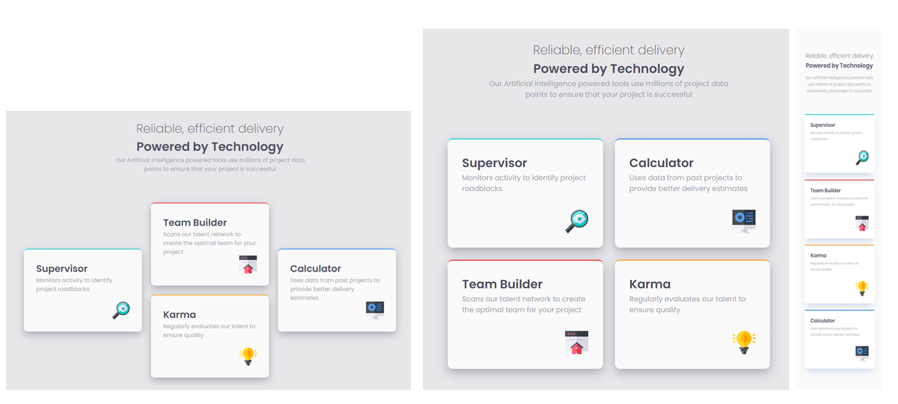

# Frontend Mentor - Four card feature section solution

This is a solution to the [Four card feature section challenge on Frontend Mentor](https://www.frontendmentor.io/challenges/four-card-feature-section-weK1eFYK).

## Table of contents

- [Overview](#overview)
  - [The challenge](#the-challenge)
  - [Screenshot](#screenshot)
  - [Links](#links)
- [My process](#my-process)
  - [Built with](#built-with)
  - [What I learned](#what-i-learned)
  - [Useful resources](#useful-resources)
- [Author](#author)

## Overview

### The challenge

Users should be able to:

- View the optimal layout for the site depending on their device's screen size
- Design tablet screen layout

### Screenshot



### Links

- Solution URL:[github.com/VikashMaurya](https://github.com/VikashMaurya10/four-card-feature-section-master)
- Live Site URL:[view🌐](https://vikashmaurya10.github.io/four-card-feature-section-master/)

## My process

### Built with

- Semantic HTML5 markup
- SCSS custom properties
- Flexbox
- Mobile-first workflow

### What I learned

By taking this challenge i more familiar with Flex Box properties.

To see how you can add code snippets, see below:

```css
main {
  .card-container {
    .cards {
      flex-wrap: wrap;
      flex-direction: row;

      &__card2 {
        order: 3;
        flex-direction: row;
      }

      &__card3 {
        order: 2;
      }
    }
  }
}
```

### Useful resources

- [@Figma](https://www.figma.com) - This helped me for measuring the design like card width, height, gap between cards reason. I really liked this pattern and will use it going forward.

## Author

- Frontend Mentor - [@Vikashmaurya](https://www.frontendmentor.io/profile/VikashMaurya10)
- LinkedIn - [@in-vikashmaurya](https://www.linkedin.com/in/in-vikashmaurya)
